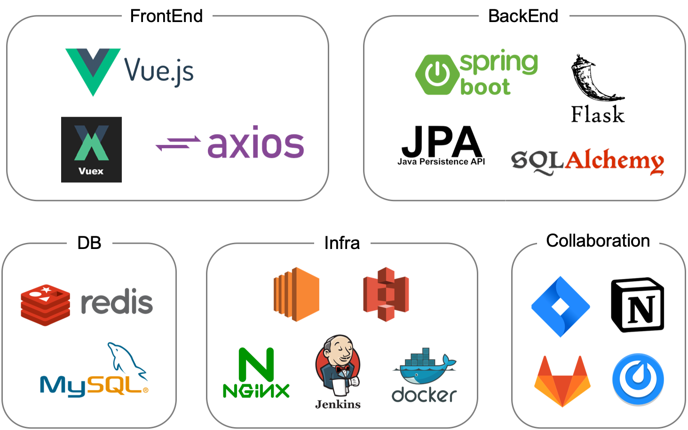

# 🔮 부키(BUKI)

 

> 취미 추천 및 기록 서비스, 부키(BUKI)

 

## ⭐️ 프로젝트 개요

#### 자신만의 부캐를 만들고 싶은 사람들을 위한 취미 추천 및 기록 서비스

- **진행 기간:** 2021.08.30 ~ 2021.10.08

- **서비스 주요 기능**
  - 나의 취향에 맞는 취미 추천
  - 취미생활을 일기로 기록
  - 취미에 따른 나의 부캐 키우기
  - 부캐별 랭킹 보여주기

- **서비스 목표**
  - 사용자의 성향에 맞는 취미 추천
  - 온/오프라인 취미 클래스 추천으로 취미생활 돕기
  - 일기를 통해 취미 활동 결과물을 남기기
  - 성장하는 부캐를 통해 성취감, 지속성 고무

 

## 🧑‍💻 팀원 소개

|                            원지연                            |                            김나영                            |                            박선아                            |                            유원선                            |                            최은송                            |
| :----------------------------------------------------------: | :----------------------------------------------------------: | :----------------------------------------------------------: | :----------------------------------------------------------: | :----------------------------------------------------------: |
|  |  |  |  |  |
|    `Front-end` `Project Manager` `UI/UX Design`    |                 `Back-end` `Front-end`                  |                 `Back-end` `Front-end`                  |         `Big Data` `CI/CD` `Data Crawling`         |               `Front-end` `UI/UX Design`                |
|       <a href="https://github.com/wonjwi">@wonjwi</a>        |                                                              |    <a href="https://github.com/SeonA1223">@SeonA1223</a>     |      <a href="https://github.com/wonsunn">@wonsunn</a>       |                                                              |

 

## 🎞 프로젝트 UCC

 

## 💡 서비스 아키텍처

 

## 📀 기술 스택

 

## 💻 실행 가이드

### [🛠 Porting Manual](./exec/PortingManual.md)

### [📜 시연 시나리오](./exec/부키_시연_시나리오.pdf)

### [💜 부키 서비스 바로가기](https://j5a303.p.ssafy.io)

- 모바일 환경에서 최적화 되어, 데스크탑에서는 *개발자 모드 + device tool*을 이용을 권장합니다
- 개발자 모드 + device tool 실행 방법
  - Window : `F12` ➡️ `ctrl` + `shift` + `m` 
  - Mac : `alt` + `cmd` + `i` ➡️ `cmd` + `shift` + `m`

 

## 🗂 개발 문서

### [☑️ Git Covention](./document/Git_Convention.md)

### 📝 프로젝트 회의록

  
1주차 회의록 (2021/08/30 ~ 2021/09/03)

  <ul>
      <li><a href="./document/dev_log/20210830_회의록.md">08월 30일 : 아이디어 기획</a></li>
      <li><a href="./document/dev_log/20210831_회의록.md">08월 31일 : 아이디어 기획, 컨설턴트 미팅</a></li>
      <li><a href="./document/dev_log/20210901_회의록.md">09월 01일 : 아이디어 기획</a></li>
      <li><a href="./document/dev_log/20210902_회의록.md">09월 02일 : 아이디어 기획, 와이어프레임 제작</a></li>
      <li><a href="./document/dev_log/20210903_회의록.md">09월 03일 : 아이디어 기획, 와이어프레임 제작</a></li>
  </ul>

  
2주차 회의록 (2021/09/06 ~ 2021/09/10)

  <ul>
      <li><a href="./document/dev_log/20210906_회의록.md">09월 06일 : 프로젝트 기능 구체화</a></li>
      <li><a href="./document/dev_log/20210907_회의록.md">09월 07일 : 서비스명 및 로고 컨셉 선정</a></li>
      <li><a href="./document/dev_log/20210908_회의록.md">09월 08일 : 프로젝트 기능 구현 방법 논의</a></li>
      <li><a href="./document/dev_log/20210909_회의록.md">09월 09일 : 프로젝트 기능 관련 수정사항</a></li>
      <li><a href="./document/dev_log/20210910_회의록.md">09월 10일 : 캐릭터 디자인 컨셉 선정</a></li>
  </ul>

  
3주차 회의록 (2021/09/13 ~ 2021/09/17)

  <ul>
      <li><a href="./document/dev_log/20210913_회의록.md">09월 13일 : 프로젝트 기능 개발</a></li>
      <li><a href="./document/dev_log/20210914_회의록.md">09월 14일 : 프로젝트 기능 개발</a></li>
      <li><a href="./document/dev_log/20210908_회의록.md">09월 15일 : 프로젝트 기능 개발</a></li>
      <li><a href="./document/dev_log/20210916_회의록.md">09월 16일 : 프로젝트 기능 개발</a></li>
      <li><a href="./document/dev_log/20210917_회의록.md">09월 17일 : 프로젝트 기능 개발</a></li>
  </ul>

  
4주차 회의록 (2021/09/23 ~ 2021/09/24)

  <ul>
      <li><a href="./document/dev_log/20210923_회의록.md">09월 23일 : 프로젝트 기능 개발</a></li>
      <li><a href="./document/dev_log/20210924_회의록.md">09월 24일 : 프로젝트 기능 개발</a></li>
  </ul>

  
5주차 회의록 (2021/09/27 ~ 2021/10/01)

  <ul>
      <li><a href="./document/dev_log/20210927_회의록.md">09월 27일 : 프로젝트 기능 개발</a></li>
      <li><a href="./document/dev_log/20210928_회의록.md">09월 28일 : 프로젝트 기능 개발</a></li>
      <li><a href="./document/dev_log/20210929_회의록.md">09월 29일 : 프로젝트 기능 개발</a></li>
      <li><a href="./document/dev_log/20210930_회의록.md">09월 30일 : 프로젝트 기능 개발</a></li>
      <li><a href="./document/dev_log/20211001_회의록.md">10월 01일 : 프로젝트 기능 개발</a></li>
  </ul>

  
6주차 회의록 (2021/10/05 ~ 2021/10/07)

  <ul>
      <li><a href="./document/dev_log/20211005_회의록.md">10월 05일 : 프로젝트 마무리 및 UCC 기획</a></li>
      <li><a href="./document/dev_log/20211006_회의록.md">10월 06일 : 프로젝트 마무리 및 최종발표 준비</a></li>
      <li><a href="./document/dev_log/20211007_회의록.md">10월 07일 : 최종발표 준비 및 산출물 제작</a></li>
  </ul>

